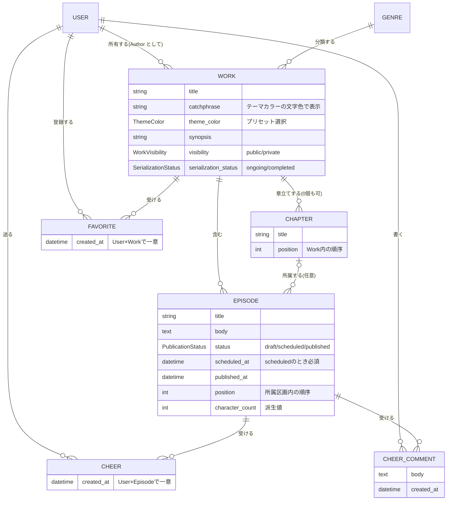

# 概念設計: 用語集・概念モデル(確定)

対象: 作品・エピソードの投稿・公開管理・閲覧 + 応援・お気に入り(拡張: 応援コメント)。
スコープの根拠は `kakuyomu-scope-cut-list.md`(確定版)。

ステータス: **確定**(2026-07-06 `open-questions.md` の全回答を反映)
最終更新: 2026-07-06

---

## 1. 用語集(ユビキタス言語)

コード・API・ドキュメントで使う英語名をここで固定する。「章」「話」「エピソード」等の揺れはこの表に従って解消する。

### エンティティ

| 概念 | 英語名 | 定義 |
|---|---|---|
| ユーザー | **User** | 認証済みアカウント。作者・読者という区別はエンティティではなく**ロール**(後述)。 |
| 作品 | **Work** | 小説1作品。作者(User)に所有される。エピソードと章の入れ物であり、公開範囲・連載ステータス等の作品単位の状態を持つ。 |
| 章 | **Chapter** | Work 内でエピソードをグルーピングする単位。タイトルと Work 内での並び順を持つ。**章を使わない作品も許す**(Work 直下にエピソードが並ぶ)。 |
| エピソード | **Episode** | 連載の1話。本文を持つ最小の公開単位。公開状態(下書き/予約/公開)のライフサイクルを持つ。 |
| ジャンル | **Genre** | 固定マスタ。Work は必ず1つのジャンルに属する(単一選択)。 |
| 応援 | **Cheer** | 読者がエピソードに送る軽量リアクション。User × Episode で一意(二重応援不可)。**取り消し・再応援が可能なトグル型**(実物確認済み、Q6)。 |
| お気に入り | **Favorite** | 読者が作品をフォローする関係。User × Work で一意。 |
| 応援コメント | **CheerComment** | エピソードに紐づく読者のコメント。本文を持つ。返信・スレッドなし(フラット1階層)。 |

### 値・属性の概念

| 概念 | 英語名 | 定義 |
|---|---|---|
| キャッチコピー | **catchphrase** | Work の短い惹句(テキストのみ)。一覧・詳細でテーマカラーの文字色で表示される。 |
| テーマカラー | **ThemeColor** | Work 単位の色設定。**プリセット54色からの単一選択**(色数は実物確認済み、具体値は実装時に受領。Q8)。キャッチコピーの表示色として使われる(表示への適用はフロントの関心事で、ドメインは「Work が色を1つ持つ」ことのみ)。 |
| あらすじ | **synopsis** | Work の紹介文。 |
| 公開状態(エピソード) | **PublicationStatus** | `draft`(下書き) / `scheduled`(予約公開) / `published`(公開)。エピソードのライフサイクル。 |
| 公開範囲(作品) | **WorkVisibility** | `public`(公開) / `private`(非公開)。作品単位のスイッチ。 |
| 連載ステータス | **SerializationStatus** | `ongoing`(連載中) / `completed`(完結済)。completed の作品には新規エピソードを追加できない。 |
| 予約公開日時 | **scheduled_at** | `scheduled` のエピソードが公開される予定日時。 |
| 公開日時 | **published_at** | エピソードが実際に公開された日時。目次に表示。 |
| 文字数 | **character_count** | 本文から保存時に算出する派生値。表示用。 |
| 並び順 | **position** | Chapter の Work 内での順序、および Episode の所属区画内での順序。話数番号(第N話)は**持たない** — 順序のみ(削除による歯抜けを許容するため)。 |

### 操作の用語

| 操作 | 英語名 | 意味 |
|---|---|---|
| 公開する | **publish** | draft → published。 |
| 予約公開する | **schedule** | draft → scheduled(scheduled_at 指定)。時刻到来で published へ。 |
| 取り下げる | **unpublish** | published → draft。 |
| 改稿する | **revise** | published のまま本文・タイトルを更新する。 |
| 並び替える / 移動する | **reorder / move** | 章内での順序変更、および章をまたいだエピソードの移動。章自体の並び替えも含む。 |
| 完結させる | **complete** | ongoing → completed。逆方向(**reopen**: completed → ongoing)も許す。 |

### アクター(ロール)

アクターはエンティティではなく、User(または未認証)の文脈上のロール。

| アクター | 英語名 | 定義 |
|---|---|---|
| ゲスト | **Guest** | 未認証の訪問者。公開作品の閲覧のみ。 |
| 読者 | **Reader** | 認証済み User。閲覧に加え、応援・お気に入り・応援コメントができる。 |
| 作者 | **Author** | ある Work の所有者である User。その Work に対してのみ投稿・公開管理・コメント削除ができる。全 User は作品を作れば Author になる(申請等はない)。 |

---

## 2. 概念モデル図

### 構造上の決定(たたき台の立場)

- **Episode は Work に直接属し、Chapter への所属は任意(nullable)**。章を使わない作品は全エピソードが章なし。章がある作品では「章なし区画」(章立て前の冒頭部)も許す。
  - 却下した代案: 「全 Work に暗黙のデフォルト章を必ず作る」。モデルは一様になるが、UI に見えない章が存在することになり、「章を使わない作品」というカクヨムの実態との対応が濁る。
- **順序は2階層**: Chapter が Work 内で position を持ち、Episode は所属区画(所属 Chapter、または章なし区画)内で position を持つ。目次の表示順は「**章なし区画(先頭)** → Chapter を position 順」で合成する(**実物確認済み(2026-07-03): 章なし区画は先頭のみ**)。この合成順がそのまま**読書順**であり、読者向けの prev/next ナビは published のエピソードのみをこの順でたどる(間の draft / scheduled は飛ばす)。
- **話数番号を持たない**: 「第N話」という番号は概念に存在しない。順序(position)のみ。公開済みエピソードの削除で歯抜けが生じても番号の振り直し問題が発生しない。
- **章の削除は「前の章への自動統合」**(Q3 確定): 配下にエピソードがある Chapter を削除すると、配下エピソードは**直前の Chapter の末尾**へ相対順序を保って移動する。先頭の Chapter を削除した場合は前の章が存在しないため、**章なし区画(先頭)の末尾**へ統合する。

---

## 3. 主要な不変条件(状態遷移図の前提)

状態遷移図のたたき台を作る際の入力。ここで合意してから遷移図に落とす。

1. **可視性の合成ルール**: エピソードが外部(Guest/Reader)から見えるのは「Work.visibility = public **かつ** Episode.status = published」のときのみ。非公開作品内の published エピソードは見えない。
2. **下書き・予約の可視性**: draft / scheduled のエピソードは、その Work の Author 本人にのみ見える。
3. **完結済の制約**: SerializationStatus = completed の Work には新規 Episode を作成できない。**禁止されるのは新規作成のみ**で、既存エピソードの改稿・並び替え・取り下げ・削除に加え、**既存 draft の publish / schedule も可**(Q1 確定。番外編・あとがきの後日公開を許容する)。
4. **予約公開の整合**: status = scheduled ⇔ scheduled_at が設定されており未来(設定時点)。時刻到来後は published として扱われる。
5. **一意性とトグル**: Cheer は User × Episode で高々1つ、かつ**取り消し(削除)・再応援が可能**(Q6 確定)。Favorite は User × Work で高々1つ(登録・解除可)。
6. **削除のガイド**: Episode の削除操作は **draft と scheduled** に許す(Q4 確定: 予約中の直接削除可)。**published は直接削除できず**、まず unpublish するよう投稿者をガイドする — スコープリスト確定判断4の実装形態。
7. **応援コメントの削除権**: CheerComment を削除できるのは、コメントの書き手本人と、そのエピソードの Author。
8. **Work 削除**(確定、Q2): Work の削除を MVP に含める。削除すると配下の Chapter / Episode / Cheer / Favorite / CheerComment はすべて消える(カスケード)。

---

## 4. 未確定の論点

**なし(2026-07-06 全問回答済み)。**本ドキュメント起票分の決着:

1. **章なし区画の位置** → 実物確認により**先頭のみ**。§2 に反映済み。
2. **scheduled の表現(状態 vs 未来の published_at)** → **案A(独立状態+毎分のスケジューラで倒す)を採用**(Q10 確定。比較は `state-machine.md` §2)。
3. **完結済作品への操作範囲** → 新規作成のみ禁止、既存 draft の publish/schedule は可(Q1 確定。不変条件3)。
4. **Work 削除** → MVP に含める。カスケード(Q2 確定。不変条件8)。
5. **Chapter の削除** → 前の章に自動統合、先頭章なら章なし区画へ(Q3 確定。§2)。

実装フェーズへの持ち越し: テーマカラー54色の具体値(Q8)、バリデーション上限値(Q9)。経緯は `open-questions.md` を参照。
