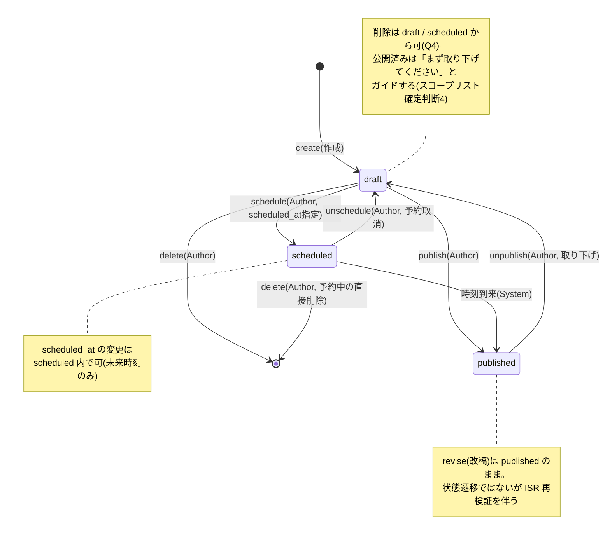
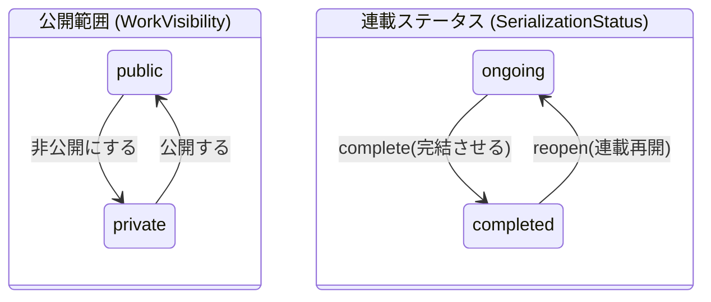

# 概念設計: 公開状態の遷移(確定)

対象: Episode の公開ライフサイクル、Work の状態(公開範囲・連載ステータス)、可視性の合成、ISR 再検証トリガー。
前提: `domain-model.md` の用語集と不変条件。

ステータス: **確定**(2026-07-06 `open-questions.md` Q1・Q4・Q5・Q7・Q10 の回答を反映。案A採用)
最終更新: 2026-07-06

---

## 1. Episode の状態遷移

### 遷移表(ガード条件つき)

| # | 遷移 | 操作 | 主体 | ガード / 備考 |
|---|---|---|---|---|
| T1 | (新規) → draft | create | Author | Work.serialization_status = ongoing のみ(completed では新規作成不可) |
| T2 | draft → published | publish | Author | completed の Work でも**可**(Q1 確定: completed が禁止するのは新規作成 T1 のみ) |
| T3 | draft → scheduled | schedule | Author | scheduled_at 必須・設定時点で未来。completed の Work でも**可**(Q1 確定) |
| T4 | scheduled → published | (時刻到来) | **System** | published_at を設定し、ISR 再検証を発火(§5) |
| T5 | scheduled → draft | unschedule | Author | scheduled_at をクリア |
| T6 | scheduled → scheduled | 予約時刻の変更 | Author | 新しい scheduled_at も未来 |
| T7 | published → draft | unpublish | Author | 即時に読者から見えなくなる。応援・コメントは消えず、再公開時に再び見える |
| T8 | published → published | revise(改稿) | Author | 状態遷移なし。ISR 再検証を発火 |
| T9 | draft → (消滅) | delete | Author | published の直接削除は不可(unpublish を先にガイド) |
| T10 | scheduled → (消滅) | delete | Author | 予約中の直接削除を許す(Q4 確定。unschedule を挟む2手は要求しない) |

許さない遷移(明示):
- published → scheduled(直接の再予約)。取り下げて draft にしてから schedule し直す。
- published → (消滅)。公開済みの直接削除は不可。unpublish で draft に戻してから delete(スコープリスト確定判断4)。

---

## 2. 予約公開の実現方式(案A採用)

### 案A: scheduled を独立した状態とし、ジョブで published に倒す(採用)

- Laravel スケジューラ(毎分 tick)が `status = scheduled AND scheduled_at <= now` を走査し、published へ遷移+ published_at 設定+ ISR 再検証を発火する。
- 長所: 状態機械が明示的(「公開済み」の意味が status だけで閉じる)。読み取りクエリが `status = 'published'` だけで済み、時刻条件の書き漏らし(=未公開コンテンツの漏洩)というクラスの事故が構造的に起きない。公開イベントが実在するので ISR 再検証・(将来の)通知の発火点として自然。障害時も次 tick で自己修復する。
- 短所: 公開時刻の精度がスケジューラ間隔(分単位)に丸められる。ジョブ基盤が必要(ただし Redis キュー/スケジューラは構築済みで追加インフラなし)。

### 案B: published + 未来の published_at で表現し、公開判定をクエリに寄せる

- 予約 = 「status を published にして published_at に未来時刻を入れる」。読み取り側は常に `published_at <= now` を条件に含める。
- 長所: 状態を倒すジョブが正しさの前提にならない。公開時刻がクエリ評価時点で正確。
- 短所(決め手): **ISR 前提ではジョブが結局必要**。ISR キャッシュは時刻の到来を自分では知らないため、scheduled_at 到来時に on-demand revalidation を叩く仕掛けがなければ、公開が ISR の revalidate 間隔ぶん遅れる。ジョブを持つなら案Bの唯一の利点が消える。加えて全読み取り経路に時刻条件が漏れなく必要で、書き漏らし=リリース前コンテンツの漏洩という高リスクの事故クラスを常に抱える。

**結論(確定 2026-07-06、Q10)**: 案Aを採用。精度は分単位(スケジューラ 1分 tick)で可とする(Q5 確定)。この比較と決定は ADR-BE の題材として起草時に記録する。

---

## 3. Work の状態(2軸・独立)

Work は互いに独立な2つの状態軸を持つ。どちらも Author がいつでも切り替え可能。

- **visibility の切替に配下エピソードの状態は連動しない**。private にしても各 Episode の status は保持され、public に戻せばそのまま見える(可視性は §4 の合成で決まる)。
- **completed のガード**: T1(新規作成)のみ禁止。T2/T3(既存 draft の publish/schedule)は**許す**(Q1 確定。番外編・あとがきの後日公開を許容)。
- **Work の削除は MVP に含める**(Q2 確定)。カスケード(配下の Chapter / Episode / Cheer / Favorite / CheerComment を削除)。

---

## 4. 可視性の合成マトリクス

「誰に何が見えるか」の正規表。実装(API の絞り込み、ISR ページの生成対象)はすべてこの表に従う。

| Work.visibility | Episode.status | Guest / Reader | Author(本人) |
|---|---|---|---|
| public | published | **見える** | 見える |
| public | scheduled | 見えない | 見える(管理画面) |
| public | draft | 見えない | 見える(管理画面) |
| private | published | 見えない | 見える(管理画面) |
| private | scheduled / draft | 見えない | 見える(管理画面) |

- 作品一覧・作品詳細(目次)に載るのは visibility = public の Work のみ。目次に載る Episode は published のみ。
- 応援・お気に入り・応援コメントの操作は「Guest/Reader に見える」状態のエピソード/作品に対してのみ可能。
- 応援・コメントのデータは Episode の状態遷移で消えない(unpublish 中は表示されないだけ)。

---

## 5. ISR 再検証トリガー対応表

ドメインイベントと、on-demand revalidation(ElastiCache backend の cacheHandler + tags-manifest)で失効させる対象の対応。フェーズ3実装時の設計入力。

| イベント | 再検証対象 |
|---|---|
| T4 公開時刻到来 / T2 publish | 作品一覧(更新順が変わる)、当該作品の目次、当該エピソードページ、**読書順で前後のエピソードページ**(prev/next リンクが変わる) |
| T7 unpublish | 同上 |
| T8 revise(改稿) | 当該エピソードページ、目次(タイトル・文字数表示) |
| 並び替え・章間移動・章の増減 | 目次、影響範囲のエピソードページ(prev/next) |
| Work メタ変更(タイトル・キャッチコピー・テーマカラー・あらすじ・ジャンル) | 作品一覧、目次(エピソードページのヘッダに作品名を出すならそれも) |
| complete / reopen | 作品一覧、目次 |
| visibility 切替 | 作品一覧、目次、配下の全公開エピソードページ |
| 応援・お気に入り・応援コメント | **on-demand 再検証しない**(Q7 確定)。エピソードページのコメント欄・カウンタは CSR で別フェッチ。目次・一覧に焼き込む応援数は**時間ベースの定期 revalidate** で遅れて反映(古さを許容する割り切り) |

---

## 6. 未確定事項

なし(2026-07-06 全問回答済み。経緯は `open-questions.md` を参照)。
